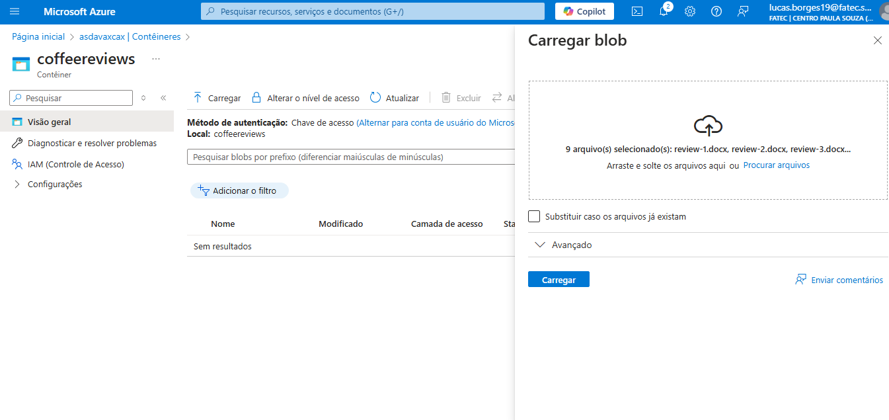
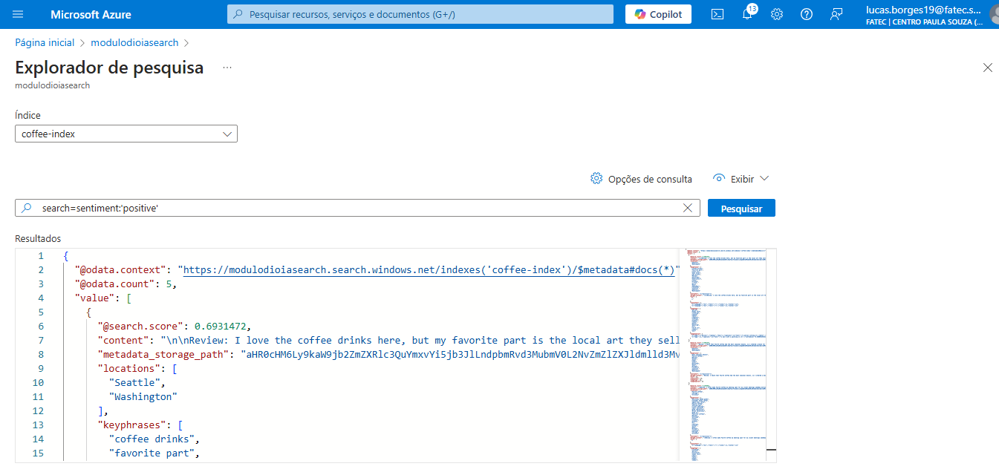

# 🔍 Azure AI Search - Indexação de Avaliações de Café ☕

## 📌 Descrição do Projeto
Este projeto foi desenvolvido como parte da plataforma [DIO](https://www.dio.me/), utilizando o **Azure AI Search** para criar um **índice de pesquisa** a partir de avaliações de clientes sobre cafés. Além disso, foi aplicado **enriquecimento com IA**, extraindo **frases-chave**, **sentimento do texto**, **localizações mencionadas** e outras informações.

## 🚀 Tecnologias Utilizadas
- **Azure AI Search** 🟦
- **Azure AI Services** 🤖
- **Azure Blob Storage** ☁️

## 🛠️ Passo a Passo da Implementação

### 1️⃣ Criando os Recursos no Azure
Criamos os seguintes recursos no portal do Azure:
- **Azure AI Search** → Para indexação e busca de dados
- **Azure AI Services** → Para enriquecimento com IA
- **Conta de Armazenamento (Blob Storage)** → Para armazenar os arquivos de entrada


### 2️⃣ Upload dos Dados no Blob Storage
- **Baixamos** os dados do repositório oficial da Microsoft: [Download Aqui](https://aka.ms/mslearn-coffee-reviews).
- **Criamos um contêiner** chamado `coffeereviews`.

- **Fizemos o upload** dos arquivos contendo as avaliações.


### 3️⃣ Configuração do Azure AI Search
- Criamos um **índice de pesquisa** chamado `coffee-index`.
- Adicionamos um **indexador** para processar os dados do Blob Storage.
- Criamos um **Skillset Cognitivo** para extrair:
  - **Frases-chave** (como "coffee drinks")
  - **Localizações** (exemplo: "Seattle, Washington")
  - **Sentimento do texto** (positivo, neutro ou negativo)
  - **OCR e análise de imagens** (caso houvesse imagens)

### 4️⃣ Exploração dos Dados no Search Explorer
Após a indexação, utilizamos o **Search Explorer** do Azure para realizar buscas.  
Exemplo de query para filtrar avaliações **positivas**:

```
{
  "search": "sentiment:'positive'",
  "count": true
}
```
##### 📌 Exemplo de retorno:

```
{
  "@search.score": 0.69,
  "content": "Review: I love the coffee drinks here, but my favorite part is the local art they sell.",
  "locations": ["Seattle", "Washington"],
  "keyphrases": ["coffee drinks", "favorite part"]
}
```


## Possibilidades de Uso
A tecnologia utilizada neste projeto pode ser aplicada em diversas áreas, como:

### 1️⃣ E-commerce 🛒

- Melhorar a busca por produtos com base em descrições e avaliações de clientes.

- Filtrar opiniões por sentimento positivo/negativo.

### 2️⃣ Suporte ao Cliente 📞

- Analisar feedbacks e identificar padrões em reclamações.

- Automatizar a categorização de tickets de suporte.

### 3️⃣ Análise de Redes Sociais 📊

- Monitoramento de sentimentos sobre uma marca.

- Identificação de tendências com frases-chave.

### 4️⃣ Pesquisa Acadêmica e Científica 📚

- Indexação de artigos científicos e extração de palavras-chave.

- Melhor organização e recomendação de conteúdos.

### 5️⃣ Gestão de Documentos Corporativos 🏢

- Facilitar a busca e recuperação de documentos internos.

- Resumir conteúdos automaticamente para insights rápidos.

### 🎯 Resultados e Aprendizados
##### ✅ Aprendi a configurar e utilizar o Azure AI Search.
#### ✅ Descobri como a IA pode enriquecer dados não estruturados.
#### ✅ Pratiquei consultas avançadas no Search Explorer.
#### ✅ Compreendi como esse tipo de projeto pode ser útil em análises de feedback de clientes.

##### 📢 Próximos Passos
### 🔹 Criar um dashboard para visualizar os resultados.
#### 🔹 Testar a integração com uma API externa para buscar avaliações em tempo real.
